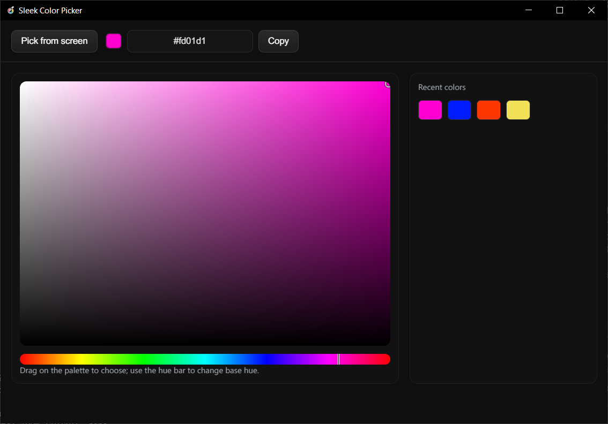

# Sleek Color Picker



Sleek, fast, and privacy-friendly Electron color picker for Windows. Pick colors from anywhere on your screens, refine via an HSV palette, and copy hex instantly.

## Features

- Eyedropper: pick a color from anywhere on your screens
- DPI-aware multi-monitor support (tested with mixed scaling)
- Live magnifier and reticle while picking
- HSV palette with hue strip and precise selection markers
- Editable hex field with 3/6-digit input support
- One-click copy to clipboard and recent color swatches
- Secure preload bridge (contextIsolation: true)
- Packaged installer (electron-builder, NSIS with install path chooser)

## Quick start

```bash
npm install
npm start
```

## Build an installer

```bash
npm run dist
```

The Windows installer will be generated under `dist/`.

## Releases

Create a version tag to trigger a GitHub Actions build and upload assets to the Release:

```bash
git tag v1.0.0
git push origin v1.0.0
```

The workflow builds the Windows installer and publishes to the tagged Release automatically.

## Usage

- Click “Pick from screen” to activate the on-screen eyedropper
- Hover to preview; click to choose a color; press Esc to cancel
- Drag in the palette to adjust saturation/value; drag the hue strip to change hue
- Click the hex value or Copy button to copy
- Click any recent swatch to reuse and copy

## Keyboard

- Esc: cancel eyedropper
- Enter in hex field: apply typed color

## Tech

- Electron latest (contextIsolation on)
- Overlay window for on-screen capture using `desktopCapturer` + `<video>` + `<canvas>`
- Color math and palette rendering in plain Canvas 2D
- IPC bridge in `src/preload.js` for clipboard and overlay control

## Project structure

```
src/
  main.js           # main + overlay window creation, IPC
  preload.js        # safe bridge (clipboard, overlay helpers)
  renderer/
    index.html      # UI shell
    index.js        # palette, hue, hex field, recent colors
  overlay/
    index.html      # transparent overlay with magnifier/reticle
    index.js        # screen sampling and cursor tracking
  assets/
    color-picker-logo.ico
```

## Notes

- The overlay first tries Chromium’s native EyeDropper API; if unavailable/denied, it falls back to screen capture sampling.
- The capture stream excludes the OS cursor, so sampling/magnifier won’t include cursor pixels.
- Multi-monitor coordinates are mapped with the display `scaleFactor` so the sampled pixel aligns with the reticle.

## Security

- No network calls or telemetry. Colors stay on your machine.
- Context isolation enabled; renderer uses a minimal preload bridge.

## Troubleshooting

- If eyedropper shows wrong area: ensure per-monitor DPI awareness is enabled in Windows display settings. This app compensates using Electron’s `scaleFactor` per display.
- If the overlay doesn’t appear on the correct monitor, move the cursor onto the desired monitor before clicking “Pick from screen”. The overlay tracks monitor changes while active.

## License

MIT


